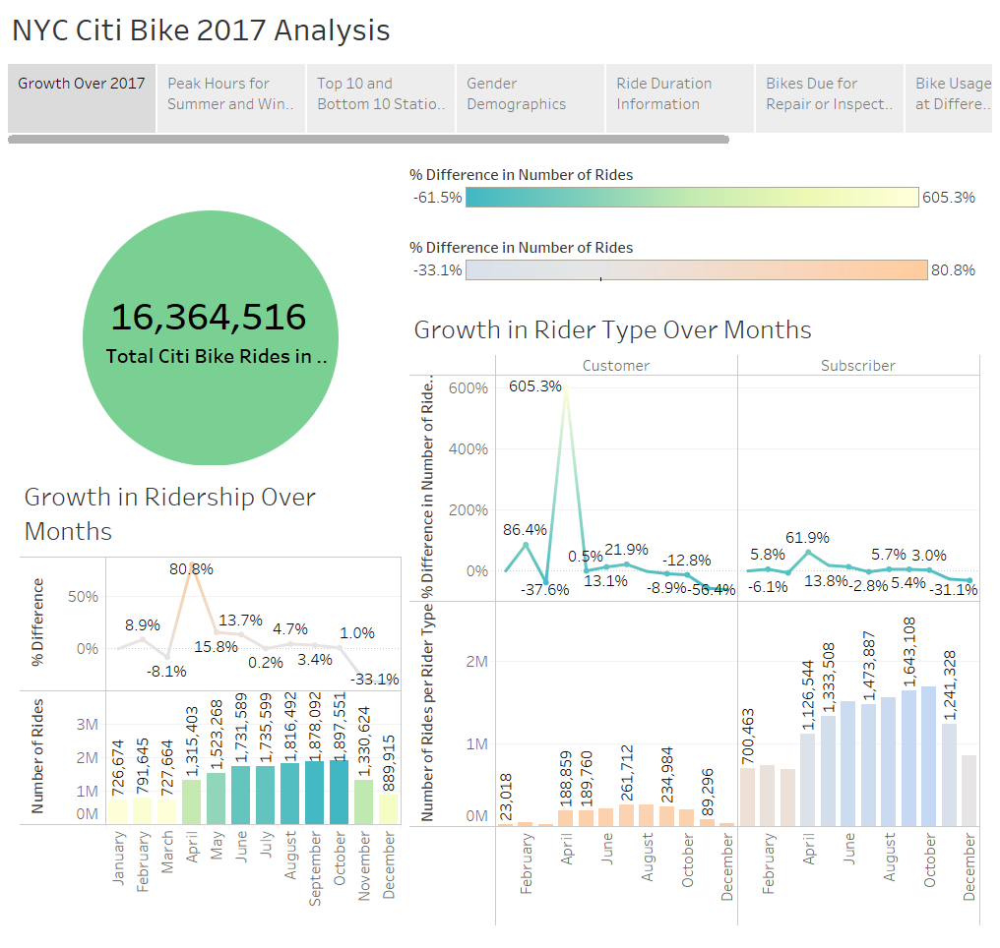
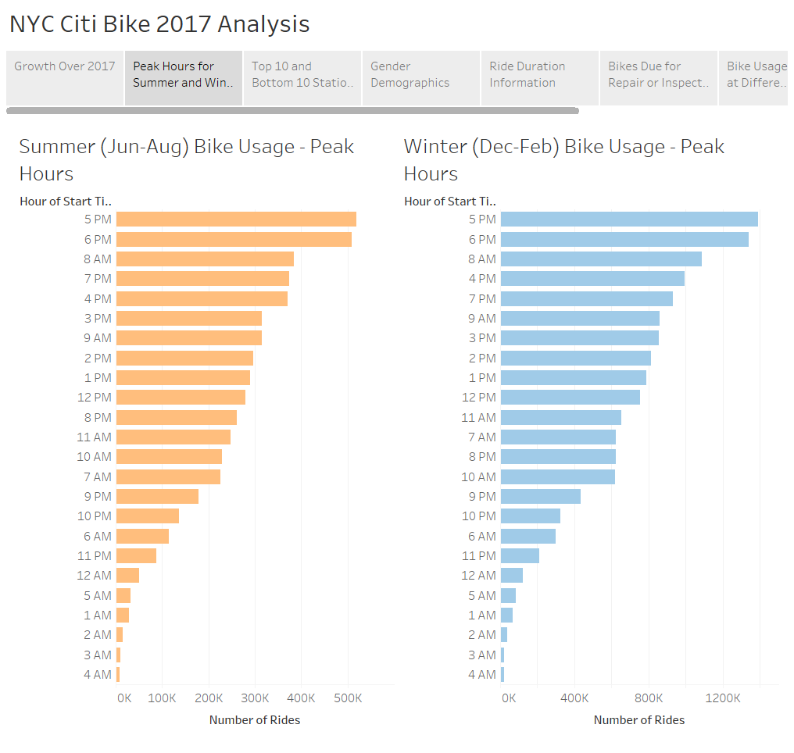
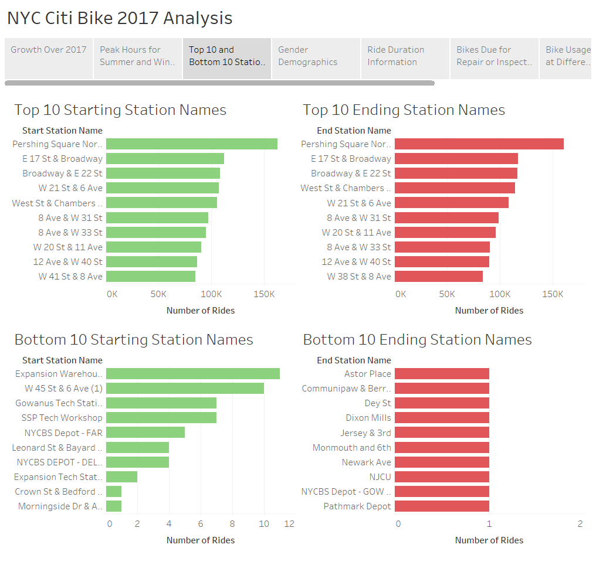
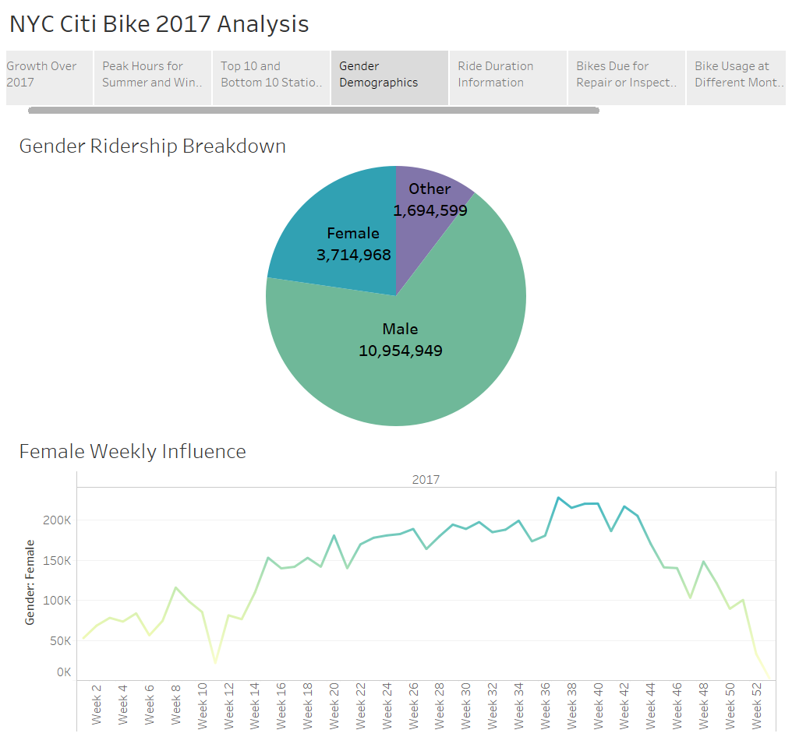
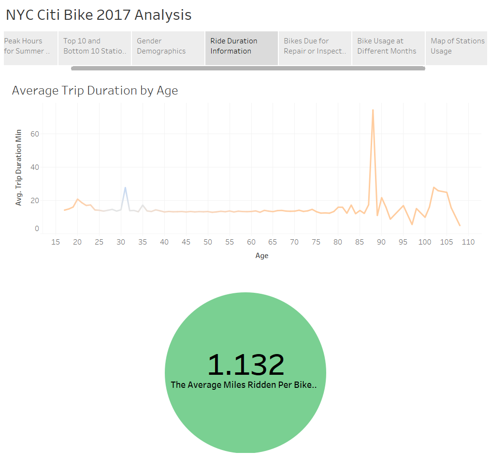
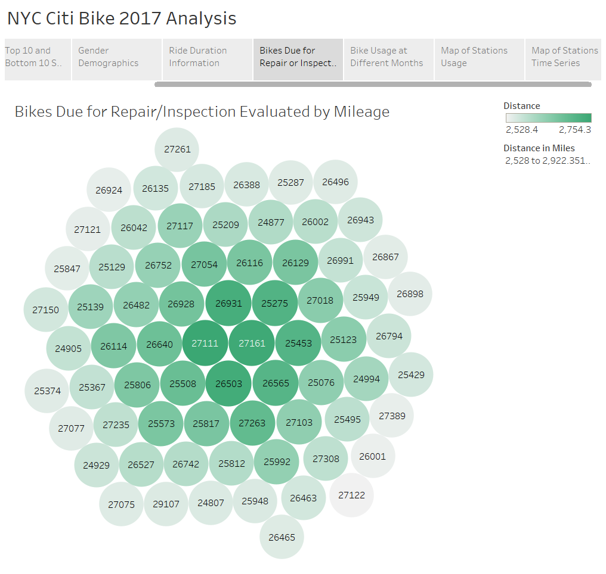
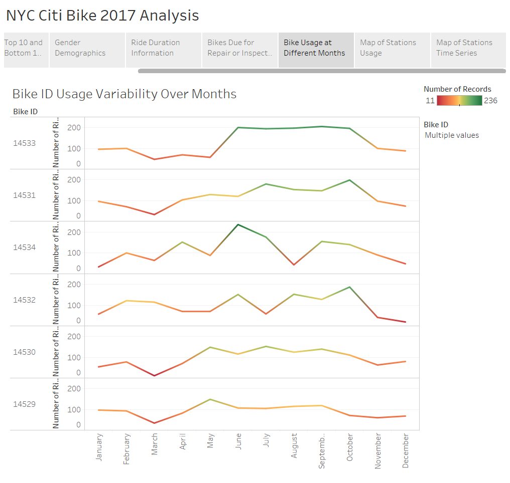
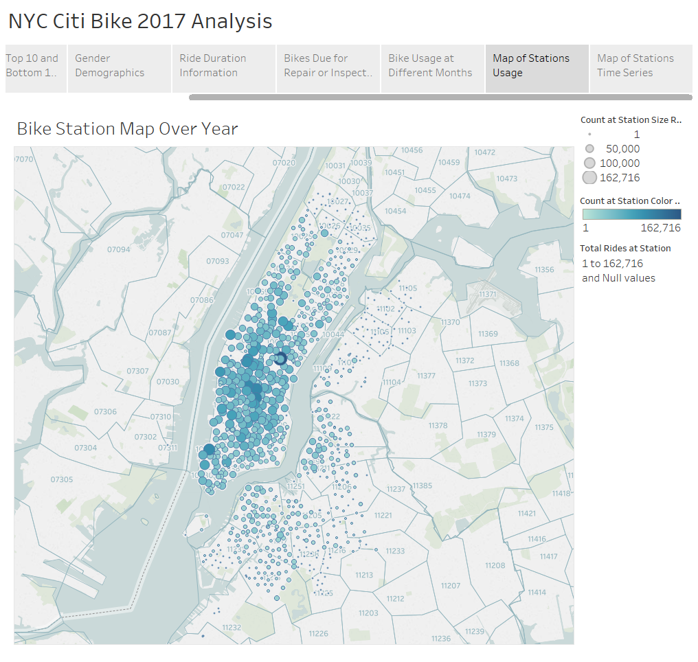
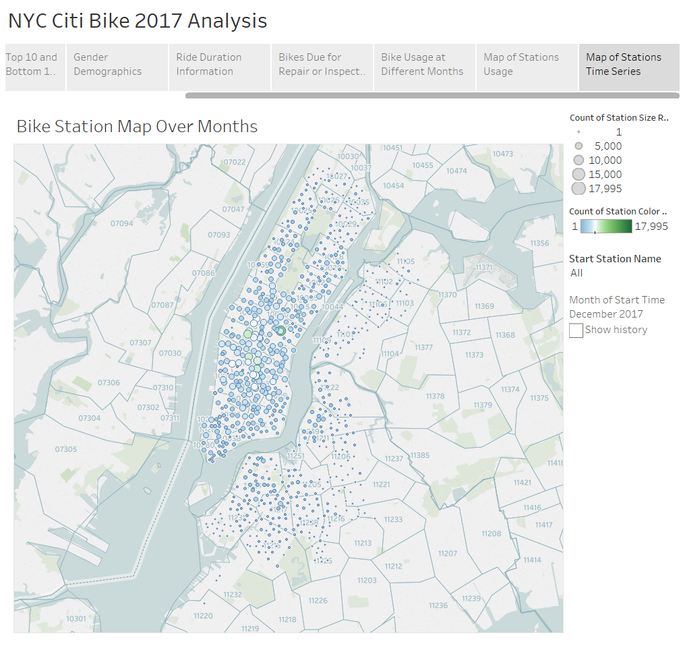

<h1 align="center"> Citi Bike Analysis </h1>

  <a href="#background">Background</a> •
  <a href="#analysis">Analysis</a> •
  <a href="#technology-stack-used">Technology Stack Used</a> •

# Background
**Experience NYC in a Whole New Way**
> [Citi Bike](https://en.wikipedia.org/wiki/Citi_Bike) is the nation's largest bike share program, with 12,000 bikes and 750 stations across Manhattan, Brooklyn, Queens and Jersey City. It was designed for quick trips with convenience in mind, and it’s a fun and affordable way to get around town.

Since 2013, the Citi Bike Program has implemented a robust infrastructure for collecting data on the program's utilization. Through the team's efforts, each month bike data is collected, organized, and made public on the [Citi Bike Data](https://www.citibikenyc.com/system-data) webpage.

In this project, the annual report for year 2017 would be generated for city officials to publicize and improve the city program.

--
# Analysis
The Tableau workbook is saved as `citi_bike_analysis.twbx` and the data used for this workbook was zipped into the `citi_bike_data_2017.csv.zip`.

--
# Technology Stack Used
- Tableau
- Python
